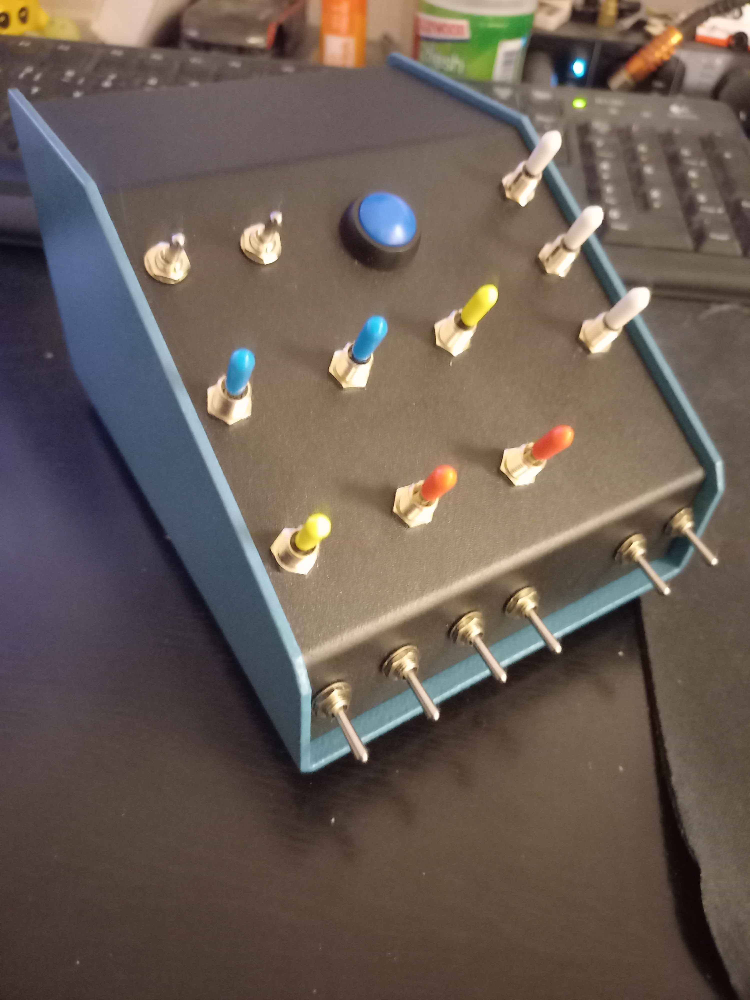
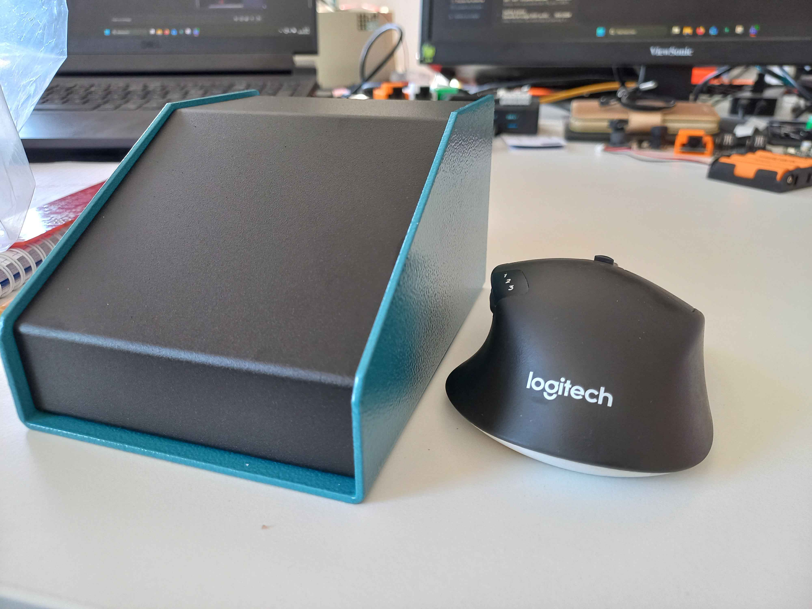
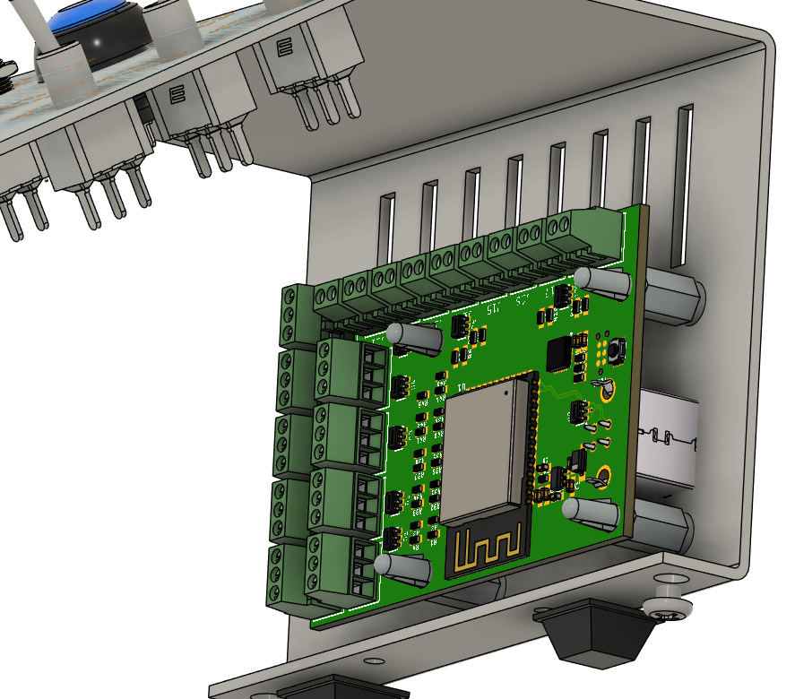

## ESP32 Sim Buttonbox
I got into flying IL-2 Great Battles pretty recently, and found myself needing a lot of buttons for control surfaces trimming, engine controls, radiators, etc...
Not enough buttons on my stick and throttle, and using keyboard is annoying! I need a button box! Good opportunity for a small personal project and learning a bit about building devices in an enclosure like this.
Time to make a simple but usable USB button box.

## What it does
This box exposes 9 bidirectional momentary switches, 8 toggle switches, and a button (27 GPIOs total). It uses an ESP32-S3 microcontroller implementing the TinyUSB stack with HID gamepad profile. This allows the box to be plug-and-play into any USB host, without the need for drivers. The circuit board and firmware are intended to be either reused as-is in other configurations, or expanded upon for more complex button boxes.

## Firmware
Written using ESP-IDF v5.5.1 framework. Install that either independently or through the VSCode extension, build,, flash, restart the board, and the USB controller should pop up in your PC's peripherals, ready to use.
The firmware itself is simple, derived from the TinyUSb HID example in ESP-IDF. A simple polling loop handles reading all the inputs, then building and sending a HID report through USB. Provisions are made in hardware to use the I/Os in Interrupt mode instead of polling (even through the I²C GPIO expander), but it's not really needed for my current use.
Keep the small Boot button pressed on the board while plugging the USB in to boot up in firmware download mode and reprogram the board if needed.

## Hardware
I designed a small 2-layer PCB implementing everything that's needed for a generic button box controller. Hook up your buttons and switches to the screw terminals on the board and start building.
The USB-B receptacle sticks out the back of the PCB, as it is intended to be mounted against the rear face of the enclosure.
I used a Hammond 1456CE3BKBU aluminium enclosure to build this project. It's relatively cheap, easy to work on, and has the perfect form factor for my space-constrained requirements.

MECHANICAL_ASSEMBLY folder contains 3D models in.step format for the following elements :
- Bare enclosure as sold
- Enclosure with the necessary drill holes for buttons, switches and mounting
- Controller circuit board
- Fully assembled button box (with all independent parts embedded in the file)

PCB_ESP32_SimButtonBox folder contains the circuit board design files :
- Parts BOM
- Autodesk EAGLE CAD files in .sch and .brd formats. Since EAGLE is now discontinued, you should be able to import them in Fusion360 Electronics with no issue. KiCAD should work too!
- Schematic in PDF format
- Gerber files for manufacturing the PCBs. I recommend getting a small solder stencil according to the Gerbers for easier reflow soldering.